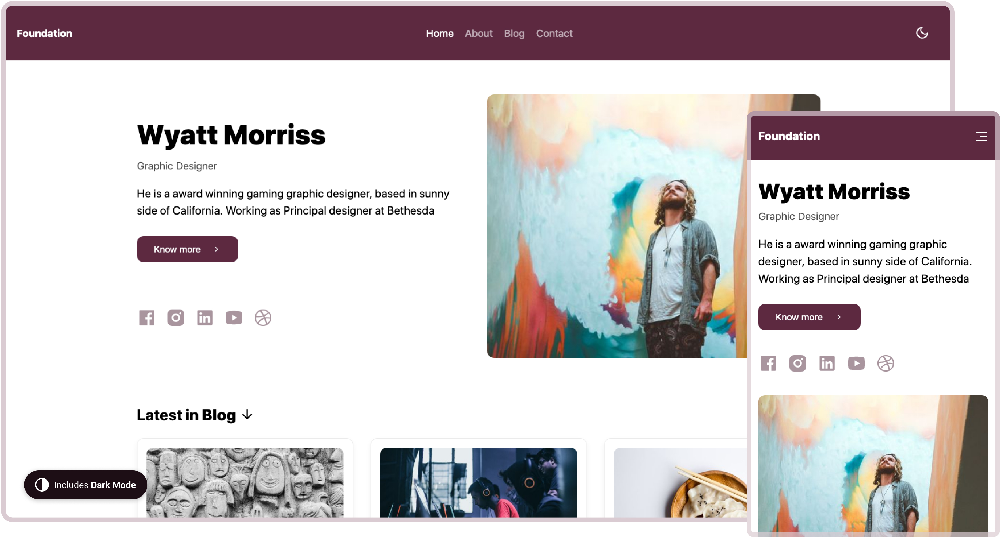
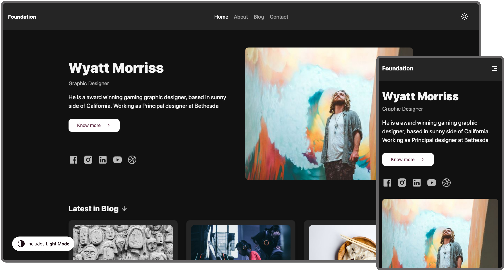

<<<<<<< HEAD
<<<<<<< HEAD
[](https://app.netlify.com/sites/frosty-perlman-9da1cb/deploys) &nbsp;<a href="https://twitter.com/intent/follow?screen_name=stackrole">
  
</a>

# Foundation

A starter to launch your blazing fast personal website and a blog, Built with [Gatsby][gatsby] and [Netlify CMS][netlifyCMS].

[](https://app.netlify.com/start/deploy?repository=https://github.com/stackrole/gatsby-starter-foundation)

Need help launching your website? My DM's are open on <a href="https://twitter.com/stackrole">twitter</a>

[](https://foundation.stackrole.com)

## 👌 Features
- A Blog and Personal website with Netlify CMS.
- Responsive Web Design
- Dark / Light Mode
- Customize content of Homepage, About and Contact page.
- Add / Modify / Delete blog posts.
- Edit website settings, Add Google Analytics and make it your own all with in the CMS.
- SEO Optimized
- Social media icons
- OpenGraph structured data
- Twitter Cards meta
- Beautiful XML Sitemaps
- Netlify Contact Form, Works right out of the box after deployment.
- Invite collaborators into Netlify CMS, without giving access to your Github account via Git Gateway
- Gatsby Incremental Builds with Netlify.


[](https://foundation.stackrole.com)

## 🚀 Quick Deploy
Just click on the **Deploy to Netlify** button.


[](https://app.netlify.com/start/deploy?repository=https://github.com/stackrole/gatsby-starter-foundation)

This would fork `gatsby-starter-foundation` to your Github account and start building your website on [Netlify](https://netlify.com). Once the deployment is done. Your website will be live and website address would look like **site-name.netlify.app**

### Further Instructions
- [Access to Netlify CMS](#access-to-netlify-cms)
- [Editing content and Adding posts](#editing-content-and-adding-posts)
- [Customing Site details](#customing-site-details)
- [Adding Custom domain to netlify website](#adding-custom-domain-to-netlify-website)
- [Install Locally](#install-locally)
- [Folder Structure](#folder-structure)
- [Learning Gatsby](#learning-gatsby)
- [Thank you from Stackrole](#thank-you)

## ⚙ Access to Netlify CMS
- Goto app.netlify.com > select your website from the list
- Goto identity and Click **Enable Identiy**
- Click on **Invite Users** and invite yourself. You will recieve an email and you need to accept the invitation to set the password.
- Now headover to Settings > Identity > Services and **Enable Git Gateway**
- You can also manage who can register and log in to your CMS. Goto  Settings > Identity > Registration >Registration Preferences. I would prefer to keep it to **Invite Only**, if i am the only one using it.
- Now, goto to **site-name.netlify.app/admin/**, and login with your credentials.

## 📝 Editing content and Adding posts
Once you are in your Netlify CMS, you can navigate to Posts and Pages. Here you will find a list of existing pages and posts. 

You can select any existing post or page to start editing or add a **New Post**. Have fun :)

## ⚙ Customing Site details
You can find all the website settings such website Site title, Website URL, Google anlaytics etc,.. in your Netlify CMS `Admin > Settings > General`


## 🌐 Adding Custom domain to netlify website
We have written a short article on [Custom domain with Netlify website](custom-domain)

## 🖥 Install Locally
Use the Gatsby CLI to create a new site, specifying the `gatsby-starter-foundation` starter.
```bash
gatsby new gatsby-starter-foundation https://github.com/stackrole/gatsby-starter-foundation
```
> You need Node and Gatsby-CLI installed, check out Gatsby [Setup Instructions](https://www.gatsbyjs.org/tutorial/part-zero/)

### Start developing
Navigate into your new site’s directory and start it up.
```shell
cd my-hello-world-starter/
gatsby develop
```

**Open the source code and start editing!**

Your site is now running at `http://localhost:8000`!

_Note: You'll also see a second link: _`http://localhost:8000/___graphql`_. This is a tool you can use to experiment with querying your data. Learn more about using this tool in the [Gatsby tutorial](https://www.gatsbyjs.org/tutorial/part-five/#introducing-graphiql)._

Open the `gatsby-starter-foundation` directory in your code editor of choice and edit. Save your changes and the browser will update in real time!

You can use Netlify CMS in you local just run `npx netlify-cms-proxy-server` and start run `gatsby develop`

## 📁 Folder Structure

A quick look at the top-level files and directories you'll see in a Gatsby project.

    .
    ├── node_modules
    ├── src
    ├── .gitignore
    ├── .prettierrc
    ├── gatsby-browser.js
    ├── gatsby-config.js
    ├── gatsby-node.js
    ├── LICENSE
    ├── package-lock.json
    ├── package.json
    └── README.md

1.  **`/node_modules`**: This directory contains all of the modules of code that your project depends on (npm packages) are automatically installed.

2.  **`/src`**: This directory will contain all of the code related to what you will see on the front-end of your site (what you see in the browser) such as your site header or a page template. `src` is a convention for “source code”.

3.  **`.gitignore`**: This file tells git which files it should not track / not maintain a version history for.

4.  **`.prettierrc`**: This is a configuration file for [Prettier](https://prettier.io/). Prettier is a tool to help keep the formatting of your code consistent.

5.  **`gatsby-browser.js`**: This file is where Gatsby expects to find any usage of the [Gatsby browser APIs](https://www.gatsbyjs.org/docs/browser-apis/) (if any). These allow customization/extension of default Gatsby settings affecting the browser.

6.  **`gatsby-config.js`**: This is the main configuration file for a Gatsby site. This is where you can specify information about your site (metadata) like the site title and description, which Gatsby plugins you’d like to include, etc. (Check out the [config docs](https://www.gatsbyjs.org/docs/gatsby-config/) for more detail).

7.  **`gatsby-node.js`**: This file is where Gatsby expects to find any usage of the [Gatsby Node APIs](https://www.gatsbyjs.org/docs/node-apis/) (if any). These allow customization/extension of default Gatsby settings affecting pieces of the site build process.

8.  **`LICENSE`**: Gatsby is licensed under the MIT license.

9. **`package-lock.json`** (See `package.json` below, first). This is an automatically generated file based on the exact versions of your npm dependencies that were installed for your project. **(You won’t change this file directly).**

10. **`package.json`**: A manifest file for Node.js projects, which includes things like metadata (the project’s name, author, etc). This manifest is how npm knows which packages to install for your project.

11. **`README.md`**: A text file containing useful reference information about your project.

## 🎓 Learning Gatsby

Looking for more guidance? Full documentation for Gatsby lives [on the website](https://www.gatsbyjs.org/). Here are some places to start:

- **For most developers, we recommend starting with our [in-depth tutorial for creating a site with Gatsby](https://www.gatsbyjs.org/tutorial/).** It starts with zero assumptions about your level of ability and walks through every step of the process.

- **To dive straight into code samples, head [to our documentation](https://www.gatsbyjs.org/docs/).** In particular, check out the _Guides_, _API Reference_, and _Advanced Tutorials_ sections in the sidebar.


## 🙏 Thank you
We really appreciate you taking time to build your website with our `gatsby-starter-foundation`. 

I would love to get your feedback and contributions. 

Feel free to ping [@stackrole](stackrole) for help regarding your JAMstack website, our DM's are open. And do not forget to share you website with me 😊

[](https://stackrole.com)

[gatsby]: https://gatsbyjs.org
[netlifyCMS]: https://www.netlifycms.org
[stackrole]: https://stackrole.com
[twitter]: https://twitter.com/stackrole
[custom-domain]: https://stackrole.com/adding-custom-domain-netlify
=======
=======
>>>>>>> parent of 8c489a6... Saty lo ha roto
# Prologue - Jekyll Theme

[](https://badge.fury.io/rb/jekyll-theme-prologue)


This is Prologue, a simple, single page responsive site template from [HTML5 UP](https://html5up.net/prologue), now available as a blog-aware Jekyll theme from [Chris Bobbe](https://chrisbobbe.github.io). It features a clean, minimalistic design and a sticky sidebar with navigation-linked scrolling.

**Demo**: https://chrisbobbe.github.io/jekyll-theme-prologue/

# Added Features

* **Blogging and multi-page features you expect from Jekyll**
* Compatible with GitHub Pages
* **[Formspree.io](https://formspree.io/) contact form integration** - just add your email to the `_config.yml` and it works!
* Build your homepage with **custom scrolly sections** in the _sections folder
 * Set a **cover photo** for any section (not just the first), with alt text for screen readers and SEO
* Add your **social profiles** easily in `_config.yml`.
* Automatic search engine optimization (SEO) **meta tags** based on info you provide in `_config.yml` and frontmatter
* **Google Analytics** built-in; just put your [Tracking ID](https://support.google.com/analytics/answer/1008080?hl=en) in `_config.yml` as `google_analytics`
* Custom **404 page** (called 404.html; to activate, move it to your project directory).

# Installation

There are two ways to get started (choose one):

1. **Install the [jekyll-theme-prologue gem](https://rubygems.org/gems/jekyll-theme-prologue).** Instructions are in the [Jekyll docs](https://jekyllrb.com/docs/themes/#installing-a-theme). After running `bundle install`, you can find the theme files by running `open $(bundle show jekyll-theme-prologue)`.  A sample working `_config.yml` file ships with the gem; if you want to activate it, move it to your project's root directory. It will do nothing until you move it there, replacing the default `_config.yml` file.
2. **Fork or clone the [GitHub repository](https://github.com/chrisbobbe/jekyll-theme-prologue).** If you want to use [GitHub Pages](https://pages.github.com/), create a branch named `gh-pages`, and replace `theme: jekyll-theme-prologue` with `remote_theme: chrisbobbe/jekyll-theme-prologue` in the provided `_config.yml` ([GitHub Pages now supports open-source themes on GitHub](https://github.com/blog/2464-use-any-theme-with-github-pages)).

Next, make sure that `url` and `base_url` are set for your own website in `_config.yml`. For local testing, make them both blank. Add a photo avatar to your project, then set `avatar: path/to/your/avatar.jpg` in _config.yml; for example, `avatar: assets/images/avatar.jpg` (48x48 pixels works best). Poke around the sample `_config.yml` file to see how you can add your social profiles.

# Build your homepage

1. **Your `_config.yml` file must include the following line or your homepage won't work**: `collections: [sections]`. This tells Jekyll to look in the _sections folder (which you will create) for your content and render it all on one page.

2. **Create a `_sections` folder** in your project's root directory and start adding content to your homepage. Set a cover photo in any of the sections by adding `cover-photo: path/to/photo.jpg` and `cover-photo-alt: your alt text here` to the section's frontmatter. Sample content is provided in the [GitHub repository](https://github.com/chrisbobbe/jekyll-theme-prologue/tree/master/_sections).

All new sections should be added as html or Markdown documents in the `_sections` folder. The following section variables can be set with [frontmatter](https://jekyllrb.com/docs/frontmatter/):
- `title` (required)
- `order` (required; orders the sequence of sections on the page. Example: `1`)
- `cover-photo` (optional; sets a background image for the section. Example: `assets/images/banner.jpg`)
- `cover-photo-alt` (required if using a cover photo. Describes the photo for screen readers and SEO; e.g. "Dome of Light art installation, Kaohsiung, Taiwan")
- `icon` (optional; see [Font Awesome](https://fontawesome.com/icons) for icon codes. Example: `fa-github`)
- `icon-style` (optional; "solid" is default, "regular" for outline style icons, or "brands" for logos)
- `auto-header` (optional; "use-title" is default, "none" for no header, or custom header text)
- `hide` (optional; if `true`, the section won't appear)

# Start blogging!

Jekyll has great resources to get you started writing blog posts. Check out [this Jekyll Docs page](https://jekyllrb.com/docs/posts/) first. When you've written a post or two, copy the following into a new file in your project directory called `blog.html`, and you'll see a link to your blog from the homepage:

```
---
layout: blog
title: My Blog
---
```

-- and that's it!

# Add a page

To add a page, just make a new .html or .md file in your project directory. There's an example called `reading-list` [provided](https://github.com/chrisbobbe/jekyll-theme-prologue/blob/master/reading-list.md) with the GitHub repository. Add this frontmatter:

```
---
title: My New Page
layout: page
---
```

You can also set these page variables in the frontmatter, if you want:
- `subtitle`
- `order` (orders links in the nav menu, e.g. `1`)
- `icon` (optional; see [Font Awesome](https://fontawesome.com/icons) for icon codes. Example: `fa-github`)
- `icon-style` (optional; "solid" is default, "regular" for outline style icons, or "brands" for logos)
- `hide` (optional; if `true`, a link won't appear in the nav menu. All this does is remove the nav link; your page will still be served to anyone who has the URL.)

**This same set of frontmatter variables (including `title`) can also be set in `index.md` and `blog.html`.** You may want to give them titles, or hide the homepage link with `hide: true` if the homepage is the only page.

For advanced SEO, this theme also lets you add `permalink` (see [Jekyll Docs](https://jekyllrb.com/docs/permalinks/#where-to-configure-permalinks)), `robots` (string, e.g. "noindex, nofollow"), and `canonical` (boolean; true is default) to any page or post.

# Contributing

Please feel free to submit issues and feature requests!

# Credits

Thanks to @andrewbanchich for his many Jekyll adaptations of HTML5 UP's elegant themes, which helped and inspired me, and of course many thanks to HTML5 UP.

Original README from HTML5 UP:

```
Prologue by HTML5 UP
html5up.net | @ajlkn
Free for personal and commercial use under the CCA 3.0 license (html5up.net/license)


This is Prologue, a simple, single page responsive site template. It features a
clean, minimalistic design and a sticky sidebar with navigation-linked scrolling.

Demo content images* are courtesy of the ridiculously talented Felicia Simion. Check out
more of her amazing work over at deviantART:

http://ineedchemicalx.deviantart.com/

(* = Not included! Only meant for use with my own on-site demo, so please do NOT download
and/or use any of Felicia's work without her explicit permission!)

Demo banner images* courtesy of Unsplash, a radtastic collection of CC0 (public domain)
images you can use for pretty much whatever.

(* = Not included)

AJ
aj@lkn.io | @ajlkn

PS: Not sure how to get that contact form working? Give formspree.io a try (it's awesome).


Credits:

	Demo Images:
		Felicia Simion (ineedchemicalx.deviantart.com)
		Unsplash (unsplash.com)

	Icons:
		Font Awesome (fortawesome.github.com/Font-Awesome)

	Other
		jQuery (jquery.com)
		html5shiv.js (@afarkas @jdalton @jon_neal @rem)
		CSS3 Pie (css3pie.com)
		background-size polyfill (github.com/louisremi)
		Respond.js (j.mp/respondjs)
		jquery.scrolly (@ajlkn)
		jquery.scrollzer (@ajlkn)
		Skel (skel.io)
```
<<<<<<< HEAD
>>>>>>> parent of 8c489a6... Saty lo ha roto
=======
>>>>>>> parent of 8c489a6... Saty lo ha roto
